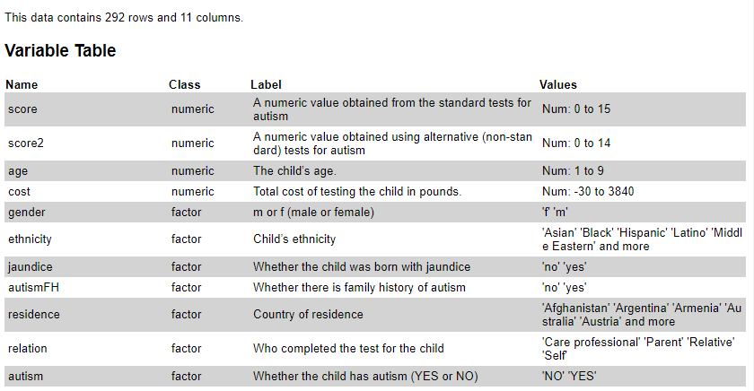
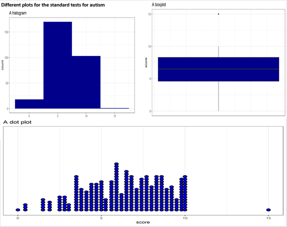
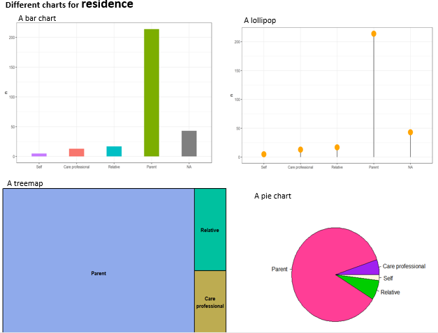

 

```{r setup, include=FALSE}
knitr::opts_chunk$set(echo = TRUE, 
                      tidy = 'styler', 
                      comment = NA,
                      message = FALSE,
                      warning = FALSE)

```

# Project instructions

Make use of the file `child.csv` available to you and load it into RStudio. It is a modified dataset (adapted from the autism dataset at https://www.kaggle.com) which contains attributes/variables for a number of children who were tested for autism. 

You are required to conduct the following tasks using R where coding is required. If, for a specific task, you are unable to undertake data preparation using R but you are able prepare your data by other means, explain how you have achieved this and complete the rest of the task in R.

## Autism data

To follow along this tutorial, you can download the dataset below:
```{r Autism dataset, echo = FALSE}

# using `DT` Java library to get download page


DT::datatable(readr::read_csv("data/child.csv"),
  caption = "Autism dataset:", extensions = "Buttons",
  options = list(dom = "Bfrtip", buttons = c("csv", "excel"))
)
```

# Import packages


```{r R packages, include=TRUE}


# Please make sure your computer is connected to the internet!


packages_needed <- c("dplyr", "tidyr", "readr", "ggplot2", "vtable", "stringr", "inspectdf", "forcats", "knitr", "kableExtra", "gt",
                     "patchwork", "treemap")

if (!require(install.load)) {
  install.packages("install.load")
}

install.load::install_load(packages_needed)


theme_set(theme_bw())
```

# Import dataset


```{r dataset}
child_data <- read_csv("data/child.csv")
```

## Data preprocessing

This removes white spaces and `'` found in any variable in the child dataset.

```{r data_cleaning}
clean_data <- child_data %>% mutate_if(~is.character(.),~str_squish(  str_remove_all(string = ., pattern = "'"))) %>% mutate_at(vars(5:11), as.factor)

```

```{r vtable, eval=FALSE}

label <-  data.frame(score = "A numeric value obtained from the standard tests for autism",
                     score2 = "A numeric value obtained using alternative (non-standard) tests for autism",
                     age = "The child’s age.",
                     cost = "Total cost of testing the child in pounds.",
                     gender= "m or f (male or female)",
                     ethnicity = "Child’s ethnicity",
                     jaundice = "Whether the child was born with jaundice",
                     autismFH = "Whether there is family history of autism",
                     residence = "Country of residence",
                     relation = "Who completed the test for the child",
                     autism = "Whether the child has autism (YES or NO)")

vtable(clean_data, labels = label,factor.limit = 5)
```




> **Autism dataset**

```{r kable1, eval=T, include=T,echo=F}

kable(clean_data, caption = "After data cleaning", align = rep("c", 15)) %>%
  kable_styling(bootstrap_options = c("striped", "hover", "condensed", "responsive"), fixed_thead = TRUE) %>%
  scroll_box(width = "900px", height = "500px")
 
```


```{r check_na, fig.height= 4.5, fig.width= 5}

clean_data %>% inspect_na() %>% show_plot()

```


## Question 1 {.tabset .tabset-fade .tabset-pills}

### Question

Produce a plot with the relative proportion of children residing in Australia, Germany, Italy and India.  Comment on your visualisation and suggests one alternative to your plot, highlighting its advantages. There is no need to plot the alternative. 


### Solution

```{r fig.height= 4.5, fig.width= 5}
dat1 <- clean_data %>% filter(residence %in% c("Australia", "Germany", "Italy", "India")) %>% count(residence) %>% mutate(prop= n/sum(n))

dat1 %>% gt() %>%
  tab_spanner(
    label = "Statistics",
    columns = vars(n, prop))
  


dat1 %>% ggplot(aes(x= reorder(residence, prop), y =prop, fill= residence))+geom_col(width = 0.5, show.legend = FALSE)+theme_bw()+labs(x = "Residence", y= "Relative proportion")+ scale_y_continuous(labels = scales::percent)


```

Among the four countries compared, it can be seen that most of the children resided in India.

Other chart that can be used to represent this data is a pie chart. 

**Advantages of a pie chart**

- presents data as a simple and easy-to-understand picture

- visually simpler than other types of graphs

- excellent when few classes of data are involved

## Question 2 {.tabset .tabset-fade .tabset-pills}

### Question

Use univariate statistics on at least the first 4 attributes to describe the data. Discuss the results obtained, highlighting any result which you consider particularly useful. Use visualisations if needed.

### Solution: part 1


```{r}

plot_box <- function(df, cols, col_x = "autism") {
  for (col in cols) {
    p <- ggplot(df, aes(x = .data[[col_x]], y = .data[[col]], fill = .data[[col_x]])) + 
      geom_boxplot(show.legend = FALSE, width = 0.2, outlier.size = 1, outlier.shape = 5, 
                   outlier.colour = "purple") +
      scale_fill_manual(values = c("YES" = "red", "NO" = "green"), aesthetics = "fill") + labs(y = str_c(col), x = NULL, title = paste0('Boxplot of ', col, ' by autism status')) + 
      theme(axis.text.x = element_text(face = "bold"), 
            axis.title.y = element_text(size = 12, face = "bold")) 
    print(p)
    
    }
}

num_cols <- 
  clean_data %>%
  select_if(is.numeric) %>%
  colnames()

plot_box(clean_data, num_cols)

```


Box plots are useful, since by construction we focused on the overlap (or not) of the quartiles of the distribution. In this case, we might ask the question like: is there sufficient differences in the quartiles for the feature to be useful in separating the label classes? It seems that all numerical features are useful in separating between children that have autism from those that did not.

As one might expect, the cost of testing the the children with autism is high compare to children without autism. Also, both standard test and alternative (non-standard) test scores are higher for children with autism than children without autism.


### Solution: part 2

```{r}

plot_bars <- function(df, cat_cols, facet_var) {
  for (col in cat_cols) {
    p <- ggplot(df, aes(x = .data[[col]], fill = .data[[col]])) +
      geom_bar(show.legend = F, width = 0.3) +
      labs(x = col, y = "Number of children", 
           title = str_c("Bar plot of ", col), subtitle = paste0('faceted by autism status')) +
      facet_wrap(vars({{ facet_var }}), scales = "free_y") +
      theme(axis.title.y = element_text(size = 12, face = "bold"), 
            axis.title.x = element_text(size = 12, face = "bold"),
        axis.text.x = element_text(angle = 45, hjust = 1, face = "bold"))

    print(p)
    
  }
}

cat_cols <- 
  clean_data %>%
  select_if(is.factor) %>%
  colnames()

cat_cols <- cat_cols[-c(5,7)] # removing the class label

plot_bars(clean_data, cat_cols, autism)  
```

There is a lot of information in these plots. The key to interpretation of these plots is comparing the proportion of the categories for whether or not a child has autism. If these proportions are distinctly different for each label category, the feature is likely to be useful in separating the label.

There are several cases evident in these plots:

Some features such as relation, autismFH, jaundice, ethnicity and gender have significantly different distribution for autism.


## Question 3 {.tabset .tabset-fade .tabset-pills}


Apply data analysis techniques in order to answer each of the questions below, justifying the steps you have followed and the limitations (if any) of your analysis. If a question cannot be answered explain why. 

### Question 3a	

- Is the score mean different for children with autism and children without autism using a significance value of 0.05?

- Is there a difference of at least 1 in mean scores between children with a family history of autism and those without a family history of autism? 


### Solution 3a

**Part 1**:

One of the assumptions of t-test of independence of means is homogeneity of variance (equal variance between groups).

The statistical hypotheses are:

**Null hypothesis ($H_0$)**: the variances of the two groups are equal.

**Alternative hypothesis ($H_a$)**: the variances are different.


```{r}

clean_data <- clean_data %>% mutate(autism = fct_relevel(autism, "YES"))

car::leveneTest(score~autism, data = clean_data)

```

**Interpretation**: The p-value is p = 0.002321 which is less than the significance level 0.05. In conclusion, there is a significant difference between the two variances.

```{r test_score}
t.test(score~autism, data = clean_data, alternative = "two.sided", var.equal = FALSE)
```

There was a significance difference in the mean score for children with autism (M = 8.41, SD = 1.19) and children without autism (M = 4.51, SD = 1.54); t(280.24) = 24.242, p < 0.05.


**Part 2**:

```{r}

clean_data <- clean_data %>% mutate(autismFH = fct_relevel(autismFH, "yes"))

car::leveneTest(score~autismFH, data = clean_data)

```

**Interpretation**: The p-value is p = 0.2198 which is greater than the significance level 0.05. In conclusion, there is no significant difference between the two variances.


```{r ttest_score4autismFH}

t.test(score~autismFH, data = clean_data, alternative = "two.sided", var.equal = TRUE )

```

There was no significance difference of at least 1 in the mean scores between children with a family history of autism (M = 5.98, SD = 2.60) and those without a family history of autism (M = 6.48, SD = 2.35); t(290) = -1.3311, p-value = 0.1842.


### Question 3b

- What is the predicted value of the alternative score (score2) for a child with a standard score of 7?

- What is the predicted value of the alternative score (score2) for a child with a standard score of 12?


### Solution 3b

**Part 1**:

This question cannot be answered directly without knowing the functional relationship between alternative score(score2) and standard score. Is alternative score(score2) a function of standard score?


If the answer is yes, then we can fit a simple linear regression such that alternative score(score2) will be a function of standard score.


```{r}

model <- lm(score2 ~ score, data = clean_data)

predict(model, data.frame(score =7))

```

$score2 = 0.04645 + 0.99450(7)$

$score2 = 7.01$

The predicted value of the alternative score (score2) for a child with a standard score of 7 is 7.01.


**Part 2**:

If alternative score(score2) is a function of standard score, then we can use R to fit the model such that:


```{r}

predict(model, data.frame(score = 12))

```


$score2 = 0.04645 + 0.99450(12)$

$score2 = 11. 98$

The predicted value of the alternative score (score2) for a child with a standard score of 12 is 11.98.


## Question 4 {.tabset .tabset-fade .tabset-pills}

### Question

Create a dataset which contains all the data in child plus a new column “ageGroup” with values “Five and under” and “6 and over”. Use one or more visualisations to compare the standard score against the cost for each age group. The visualisation(s) should also show whether there was a family history of autism. Comment on your visualisations.

### Solution

```{r}
clean_data <- 
clean_data %>% mutate(ageGroup = 
                          case_when(age >= 6~"6 and over",
                                    TRUE~"Five and under"))

clean_data %>% ggplot(aes(x= cost, y= score, color= ageGroup))+geom_line()+facet_grid(ageGroup~autismFH, scales = "free")
```

Children whose age is five years and under and with family history of autism have a lower cost of standard
test for autism.


## Question 5 {.tabset .tabset-fade .tabset-pills}

Critically discuss the following statement, using at most 3 plot examples to illustrate your explanations [ Word limit 300].

There are different methods of displaying data, with no method being suitable for the visualisation of all types of data. Some visualisations easily convey the information they are designed to communicate whereas others fail to adequately show the data. Data-ink ratio and lie factor also play a part in the quality of a visualisation.”
Note: your plot examples must relate to the child dataset.

### Solution: Part 1

```{r, eval = FALSE}
p1 <- clean_data %>% ggplot(aes(x= score))+geom_histogram(binwidth = 5, fill= "dark blue")+labs(title = "A histogram")

p2 <- clean_data %>% ggplot(aes(y= score))+geom_boxplot(fill = "dark blue") + theme(axis.text.x = element_blank(), axis.ticks.x = element_blank())+labs(title = "A boxplot")

p3 <- clean_data %>%  ggplot(aes(x = score)) + geom_dotplot(binwidth = 0.23, stackratio = 1, fill = "blue", stroke = 2)+scale_y_continuous(NULL, breaks = NULL)+labs(title = "A dot plot")
  
  
p1/(p2+p3) + plot_annotation(title = 'Different plots for the standard tests for autism')

```




A histogram and a boxplot are the most common charts for showing the distribution of a continuous variable. Another chart that can be used for continuous, quantitative, and univariate data is a dot plot. It is a simplest statistical plot that is suitable for small to moderate sized data set. A dot plot may become too cluttered when dataset involves more than 20 points. Other charts that can be more efficient are boxplot, histogram or violin plot. A dot plot is similar to a bar chart because the height of each “bar” of dots is equal to the number of items in a particular category. 

### Solution: Part 2

```{r, eval= FALSE}

p1 <- clean_data %>% count(relation) %>%  ggplot(aes(x=reorder(relation,n), y= n, fill= relation))+geom_col(width = 0.4, show.legend = FALSE) +labs(title = "A bar chart", x = "")

p2 <- clean_data %>% select(relation) %>% count(relation) %>%  ggplot(aes(x=reorder(relation,n, na.rm= T), y= n)) +
    geom_segment(aes(xend=relation, yend=0)) +
    geom_point(size= 6, color="orange") +
    theme_bw() +
    xlab("")

p3 <- clean_data %>% select(relation) %>% count(relation) %>%   treemap(index = "relation", vSize = "n", title = "A treemap")

p4 <- pie (table(clean_data$relation),col = c("purple", "violetred1", "green3",
                       "cornsilk"), radius = 0.9, main = "A pie chart") 
```



Among the four charts used for displaying the distribution of residence, pie chart has the following disadvantages:

- pie chart becomes less effective if too many pieces of data are used

- One has to factor in angles and compare non-adjacent slices before one can understand a pie chart.

## Question 6 {.tabset .tabset-fade .tabset-pills}

### Question

Assume that, in addition to the child dataset supplied with this coursework (dataset 1), you also have another 19 independent datasets with the same number of observations about children tested for autism. Load the dataset name independent_data.csv which have distribution for attribute autism and demonstrate that the size of the confidence intervals for the average percentage of positive cases of autism (autism = YES) increases as the confidence level increases. Use 90%, 95% and 98% confidence. Discuss any improvements which may enhance your demonstration.

### Solution

```{r independent_data}
another_dataset <- read_csv("data/independent_dataset.csv")

```


```{r conf.size_function}

# This function returns size of confidence interval

conf.size <- function(dataset,level = 0.90){
  
  t_test <-  t.test(dataset [ , 2] %>% pull, conf.level = level)
  
  print(t_test$conf.int)
  
}
```


```{r}
conf.size(another_dataset, level = 0.9)
```

The 90 percent confidence interval for the average percentage of positive cases of autism is between 48.42 and 50.42.

```{r}
conf.size(another_dataset, level = 0.95)
```

The 95 percent confidence interval for the average percentage of positive cases of autism is between 48.20 and 50.64.

```{r}
conf.size(another_dataset, level = 0.98)
```

The 98 percent confidence interval for the average percentage of positive cases of autism is between 47.94 and 50.90.

> Over all interpretation

This demonstrates that as the confidence level increases the size of the confidence intervals 
becomes wider and this makes us to fail to reject the null hypothesis.

---

 

---

I hope you enjoy this article and if you like this write up, you can also follow me on [Twitter](https://www.twitter.com/gbganalyst){target="_blank"} and [Linkedin](https://www.linkedin.com/in/ezekiel-ogundepo/){target="_blank"} for more updates in `R`, `Python`, and `Excel` for data science. The Github repository of this tutorial can be found [here](https://github.com/gbganalyst/Data-Visualization-and-Analysis).

  